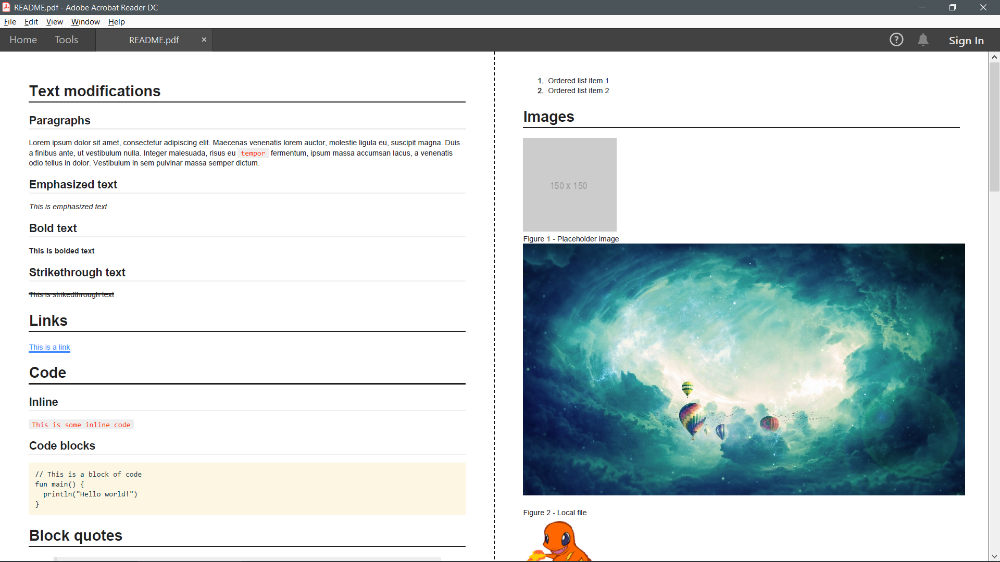
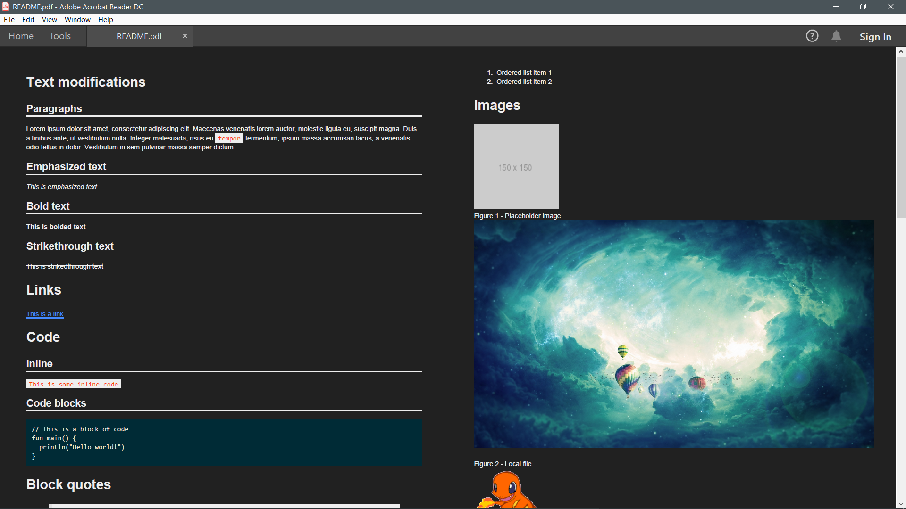
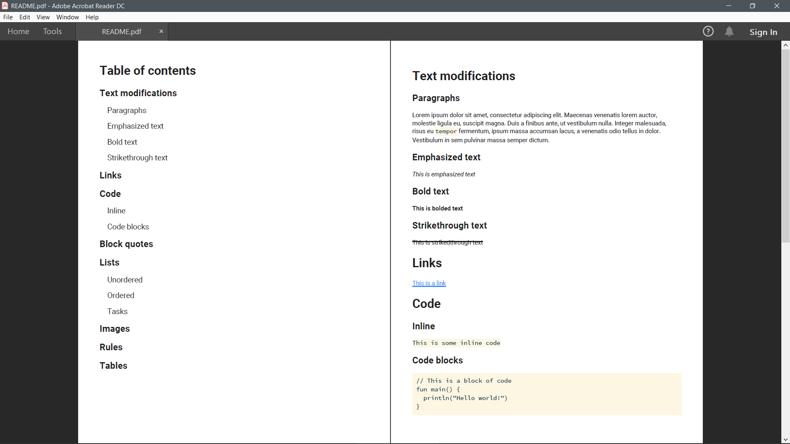

[](https://travis-ci.org/omnius-project/kMD2PDF)
[](https://github.com/omnius-project/kMD2PDF/blob/master/LICENSE)
[](http://omnius-project.github.io/kMD2PDF)
[](https://maven-badges.herokuapp.com/maven-central/com.github.woojiahao/kMD2PDF/)


> Simple and highly customizable markdown to PDF conversion library

**Note:** Version 0.2.x has been released! Check out the 
[changelog](https://omnius-project.github.io/kMD2PDF/#/Changelog) to see what's new!

## Jump To
1. [Installation Guide](https://github.com/omnius-project/kMD2PDF#installation-guide)
2. [Quick Start Guide](https://github.com/omnius-project/kMD2PDF#quick-start-guide)
3. [Previews](https://github.com/omnius-project/kMD2PDF#previews)

## Installation Guide
The repository is hosted on [Maven Central](https://search.maven.org/artifact/com.github.woojiahao/kMD2PDF). You can 
add it to your project using the following code based on your build tool:

### Maven
```xml
<dependency>
  <groupId>com.github.woojiahao</groupId>
  <artifactId>kMD2PDF</artifactId>
  <version>0.2.2</version>
</dependency>
```

### Gradle
```groovy
implementation 'com.github.woojiahao:kMD2PDF:0.2.2'
```

If you encounter errors with loading the library, visit the troubleshooting guide 
[here.](https://omnius-project.github.io/kMD2PDF/#/InstallationGuide?id=troubleshooting)

## Quick Start Guide
All examples are taken from the [examples repository.](https://github.com/omnius-project/kMD2PDF-examples)

```kotlin
val document 
  get() = MarkdownDocument("resources/markdown-all-in-one.md")
```

### Default styling
Example [here.](https://github.com/omnius-project/kMD2PDF-examples/blob/master/src/main/kotlin/com/github/woojiahao/DefaultStyling.kt)
```kotlin
fun main() {
  val converter = markdownConverter {
    document(document)
  }
  converter.convert()
}
```

### Specifying PDF location
Example [here.](https://github.com/omnius-project/kMD2PDF-examples/blob/master/src/main/kotlin/com/github/woojiahao/SpecifyingPDFLocation.kt)
```kotlin
fun main() {
  val converter = markdownConverter {
    document(document)
    targetLocation("${System.getProperty("user.home")}/Desktop/exported.pdf")
  }
  converter.convert()
}
```

### Conversion success
Example [here.](https://github.com/omnius-project/kMD2PDF-examples/blob/master/src/main/kotlin/com/github/woojiahao/OnCompleteAction.kt)
```kotlin
fun main() {
  val converter = markdownConverter {
    document(document)
  }
  val conversionResult = converter.convert()
  conversionResult.success {
    if (Desktop.isDesktopSupported()) Desktop.getDesktop().open(it)
  }
}
```

### Conversion failure
Example [here.](https://github.com/omnius-project/kMD2PDF-examples/blob/master/src/main/kotlin/com/github/woojiahao/OnErrorAction.kt)
```kotlin
fun main() {
  val converter = markdownConverter {
    document(document)
  }
  val conversionStatus = converter.convert()
  conversionStatus.failure {
    if (it is FileNotFoundException) println("File is currently already open")
  }
}
```

### Custom styling using style DSL
Example [here.](https://github.com/omnius-project/kMD2PDF-examples/blob/master/src/main/kotlin/com/github/woojiahao/SimpleStyling.kt)

More on this subject can be found on the documentation site [here.](https://omnius-project.github.io/kMD2PDF/#/StyleDSL)
```kotlin
fun main() {
  val converter = markdownConverter {
    document(document)

    settings {
      fontSize = 16.0.px
      font = FontFamily("Roboto", "Lato")
      monospaceFont = FontFamily("Fira Code")
    }

    style {
      p {
        textColor = c("455A64")
      }

      ul {
        listStyleType = SQUARE
      }

      selector("tr:nth-child(even)") {
        "background-color" to "#f2f2f2"
      }
    }
  }
  converter.convert()
}
```

### Exporting to HTML
Example [here.](https://github.com/omnius-project/kMD2PDF-examples/blob/master/src/main/kotlin/com/github/woojiahao/ConversionTargets.kt)

More on the subject [here.](https://omnius-project.github.io/kMD2PDF/#/ConversionTargets)

```kotlin
fun main() {
  val converter = markdownConverter {
    document(document)
    conversionTarget(MarkdownConverter.ConversionTarget.HTML)
  }
  converter.convert()
}
```

## Previews
### Sample document


### Dark theme


### Auto-generated table of contents
