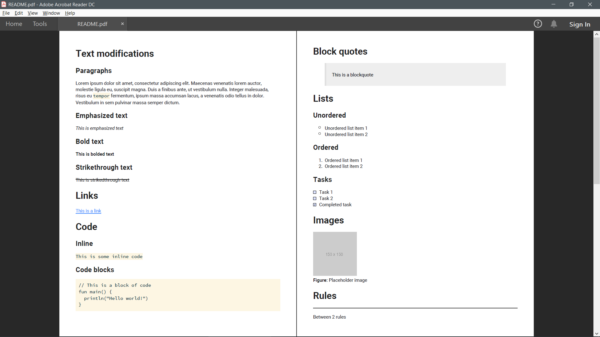
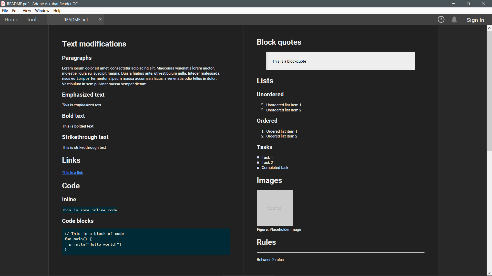

[](https://travis-ci.org/omnius-project/kMD2PDF)
[](https://github.com/omnius-project/kMD2PDF/blob/master/LICENSE)
[](http://omnius-project.github.io/kMD2PDF)
[](https://maven-badges.herokuapp.com/maven-central/com.github.woojiahao/kMD2PDF/)


> Simple and highly customizable markdown to PDF conversion library

**Note:** Version 0.2.0 has been released! Check out the changelog to see what's new!

## Jump To
1. [Installation Guide](https://github.com/omnius-project/kMD2PDF#installation-guide)
2. [Quick Start Guide](https://github.com/omnius-project/kMD2PDF#quick-start-guide)
3. [Previews](https://github.com/omnius-project/kMD2PDF#previews)

## Installation Guide
The repository is hosted on [Maven Central](https://search.maven.org/artifact/com.github.woojiahao/kMD2PDF). You can 
add it to your project using the following code based on your build tool:

### Maven
```xml
<dependency>
  <groupId>com.github.woojiahao</groupId>
  <artifactId>kMD2PDF</artifactId>
  <version>0.2.0</version>
</dependency>
```

### Gradle
```groovy
implementation 'com.github.woojiahao:kMD2PDF:0.2.0'
```

If you encounter errors with loading the library, visit the troubleshooting guide [here.](https://omnius-project.github.io/kMD2PDF/#/InstallationGuide?id=troubleshooting)

## Quick Start Guide
All examples are taken from the [examples repository.](https://github.com/omnius-project/kMD2PDF-examples)

### Default styling
Example [here.](https://github.com/omnius-project/kMD2PDF-examples/blob/master/src/main/kotlin/com/github/omnius-project/basic/DefaultStyling.kt)
```kotlin
fun main() {
  val markdownDocument = MarkdownDocument("resources/markdown-all-in-one.md")
  markdownDocument.toPDF()
}
```

### Specifying PDF location
Example [here.](https://github.com/omnius-project/kMD2PDF-examples/blob/master/src/main/kotlin/com/github/omnius-project/basic/SpecifyingPDFLocation.kt)
```kotlin
fun main() {
  val markdownDocument = MarkdownDocument("resources/markdown-all-in-one.md")
  markdownDocument.toPDF("${System.getProperty("user.home")}/Desktop/exported.pdf")
}
```

### onComplete
Example [here.](https://github.com/omnius-project/kMD2PDF-examples/blob/master/src/main/kotlin/com/github/omnius-project/basic/OnCompleteAction.kt)
```kotlin
fun main() {
  val markdownDocument = MarkdownDocument("resources/markdown-all-in-one.md")
  markdownDocument.onComplete {
    println("Conversion success - opening document")

    if (Desktop.isDesktopSupported()) {
      Desktop.getDesktop().open(it)
    } else {
      System.out.println("Awt Desktop is not supported!")
    }
  }
  markdownDocument.toPDF()
}
```

### onError
Example [here.](https://github.com/omnius-project/kMD2PDF-examples/blob/master/src/main/kotlin/com/github/omnius-project/basic/OnErrorAction.kt)
```kotlin
fun main() {
  val markdownDocument = MarkdownDocument("resources/markdown-all-in-one.md")
  markdownDocument.onError {
    println("An error occurred")

    if (it is FileNotFoundException) {
      println("File is currently already open")
    }
  }
  markdownDocument.toPDF()
}
```

### Custom styling using style DSL
Example [here.](https://github.com/omnius-project/kMD2PDF-examples/blob/master/src/main/kotlin/com/github/omnius-project/basic/SimpleStyling.kt)

More on this subject can be found on the documentation site [here.](https://omnius-project.github.io/kMD2PDF/#/StyleDSL)
```kotlin
fun main() {
  val customStyle = createDSLStyle()
  val markdownDocument = MarkdownDocument("resources/markdown-all-in-one.md", customStyle)
  markdownDocument.toPDF()
}

fun createDSLStyle() = Style
    .createStyle(
        16.0,
        FontFamily("Roboto", "Lato")
    ) {
      p {
        textColor = c("455A64")
      }

      inlineCode {
        fontFamily {
          +"Fira Code"
        }
      }

      ul {
        listStyleType = List.ListStyleType.SQUARE
      }

      selector("tr:nth-child(even)") {
        "background-color" to "#f2f2f2"
      }
    }
```

## Previews
##### Side by side


##### Light theme


##### Dark theme


##### Auto table of contents
