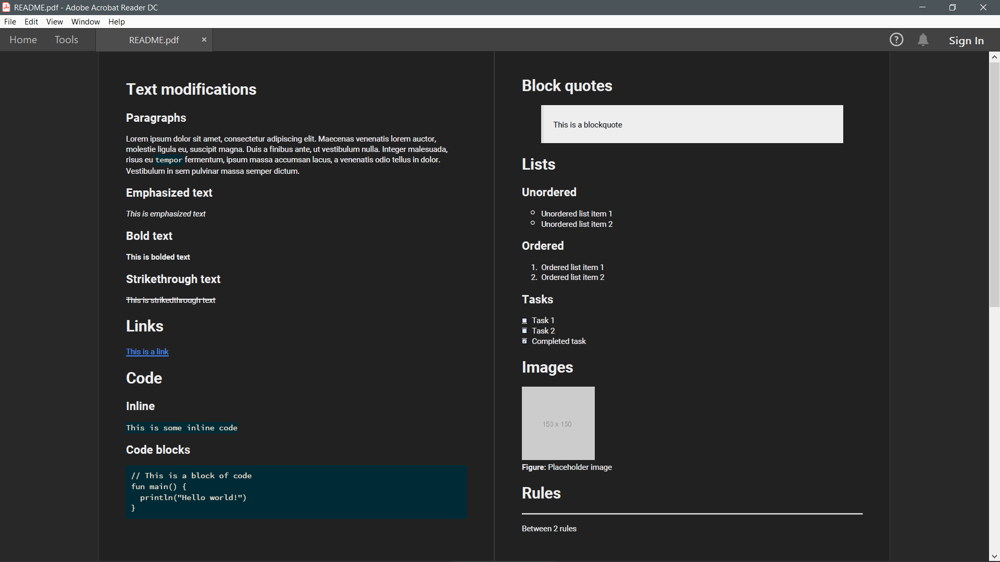

> Simple and highly customizable markdown to PDF conversion library

**Note:** Version 0.2.x has been released! Check out the [changelog](Changelog.md) to see what's new!

View more previews [here](Previews.md)

## About
kMD2PDF is a library written in Kotlin that converts markdown files to PDF documents. It aims to be easy to use and 
provide users with high customization options for the exported PDF document.

## Libraries Used
* [Commonmark Java](https://github.com/atlassian/commonmark-java)
* [flyingsaucer](https://github.com/flyingsaucerproject/flyingsaucer)